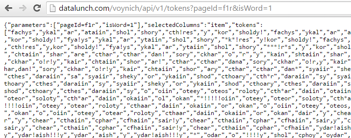
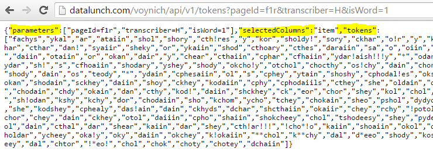
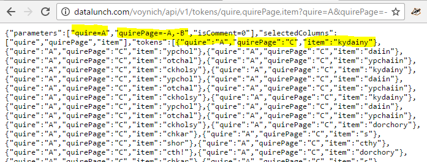
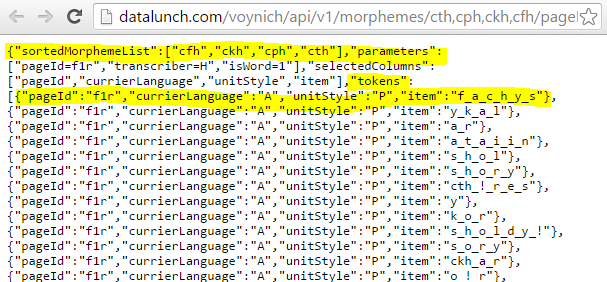
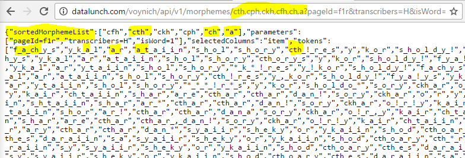

## Background

Per the [Wikipedia entry](https://en.wikipedia.org/wiki/Voynich_manuscript), the Voynich 
Manuscript is described:

> The Voynich manuscript is an illustrated codex hand-written in an unknown 
> writing system. The vellum on which it is written has been carbon-dated to the early 
> 15th century (1404–1438), and it may have been composed in Northern Italy during the 
> Italian Renaissance. The manuscript is named after Wilfrid Voynich, a Polish book 
> dealer who purchased it in 1912.

This so-called 'Voynich Manuscript' currently (2016) lives at the Beinecke Rare Book &
Manuscript Library in New Haven, Connecticut, USA. The Beinecke reference  for the 
manuscript is [MS408](http://brbl-dl.library.yale.edu/vufind/Record/3519597):

> Scientific or magical text in an unidentified language, in cipher, apparently based
> on Roman minuscule characters.

Over several decades, there have been many projects undertaken to attempt to understand 
the text of the manuscript. To date, there is no commonly accepted explanation for how 
the text can be read, parsed, or generally understood.

Major contributions to the understanding of this document include development of a 
transcription system called EVA (European Voynich Alphabet) developed by Gabriel Landini and 
[Rene Zandbergen](http://www.voynich.nu/transcr.html). This transcription system
was used in a generally available 'interlinear' file compiled and edited by 
[Jorge Stolfi](https://en.wikipedia.org/wiki/Jorge_Stolfi) and is available 
[here](http://www.ic.unicamp.br/~stolfi/voynich/98-12-28-interln16e6/).

Readers new to the subject are advised to read more widely on this topic before proceeding.

### Choices when processing the interlinear

There are many analyses of the text online where the analysis is based on some extract
from the text, often using the EVA transcription mentioned above. In many of these analyses
there are interesting and worthwhile findings. Where an interested reader has discovered an
analysis which they find interesting, it is often quite a difficult task to establish the same 
data-set. This is due to a number of factors including decisions relating to choice of extracts 
from the text and pre-processing of those extracts. Here are some examples of these choices:

* Selection of specific pages, or quires (sets of pages)
* Selection of pages where a specific type of hand-writing is detected (e.g. Currier hands)
* Filtering out of tokens that include certain processing data such as filler characters

There are many other example of pre-processing which can be discovered by researching existing
textual analysis documented on the internet and elsewhere.

There is specific form of pre-processing of EVA transcriptions that is worth detailing here - 
that of the logic of combining various sets of characters in the transcription into 'syllables' 
or what this API terms 'morphemes'. Morpheme is preferred as a term  because 'syllable' carries 
additional meaning related to speech.

Let us take an example in English - the word 'writing'. This word is naturally separated into two
items 'writ' and 'ing'. In the EVA transcription of the Voynich Manuscript one may find words that have
multiple options regarding breaking down the word into morphemes. The classic example is 'daiin' which 
has several options for morphemization - here are some common options:

* d_a_i_i_n
* d_a_ii_n
* d_aii_n

### General use for this API

This API exposes a number of options including:

* Retrieve a filtered list of tokens using the dimensions of the interlinear file e.g.
  * Pages
  * Quires
  * Unit styles
* Filter the tokens according to attributes such as:</li>
  * Contains filler characters
  * Contains dubious word breaks
  * Eliminate in-line comments from the transcription</li>
  * Supply a list of morphemic filters in order to retrieve a list of tokens that map to the 
transcription assumptions of the user
 
**It is hoped that by making this functionality available, that text analysis experiments can be
repeated by any other researcher by making the foundation data-set available in a transparent, 
consistent and repeatable format.**

## API development methodology

Readers are encouraged to download the interlinear and explore the structure in order to better 
understand the development process described below.

In order to develop the API, the following steps were followed:

1. Retrieve the interlinear file - the version used was 1.6e6
2. Parse the interlinear file and detect the following content:
  * Pages; with attributes
    * Page Id e.g. f1r
    * Page Number e.g. 1
    * Page recto/ verso id e.g. v1 from f72v1
    * Quire e.g. A
    * Quire Page e.g. A
    * Currier Hand e.g. 1
    * Currier Language e.g. A
    * Illustration Type e.g. H
    * Illustration Type Description e.g. Herbal
    * Contains Extraneous Writing (0/1)
  * Each page has a collection of page units; with attributes
    * Unit Code e.g. P1
    * Unit Style e.g. P<
    * Unit Style Description e.g. Paragraph
  * Each page unit has a collection of lines; with attributes
    * Line Number e.g. 1
    * Transcriber e.g. H (Takeshi Takahashi)
  * Each page unit line has a collection of items i.e. tokens or comments; with attributes
    * HasDubiousWordBreak: contains ,
    * HasFiller: contains a ! or % character
    * IsAmbiguous: contains a * character
    * IsComment: {comment}
    * IsEndOfLine: - follows token
    * IsEndOfParagraph: = follows token
    * IsWord: contains a ! or % character
    * Item: contains a ! or % character
3. Comments were captured in the parsing process but are not currently available via the API
4. The data was converted to a de-normalised flat table with 23 columns per above bullets:
  * Table was imported to a SQLite database
  * [Slim PHP Framework](http://www.slimframework.com/) was used to expose table via a RESTful API
            
## How to use the API
      
### In a browser

You can open a browser window and enter:

    http://datalunch.com/voynich/api/v1/tokens?pageId=f1r&isWord=1

Which means _get me the tokens from page f1r where the token is a word_. 

Specifically, the meaning of 'a word' is that it is not an interlinear comment.

We could write this in SQL as:

    select 
      item 
    from 
      tokens 
    where 
      pageId='f1r' 
      and isWord=1

It will return this:

It many circumstances it will be preferred to specify a transcriber as most lines in 
the interlinear file have multiple transcriptions e.g.:

    http://datalunch.com/voynich/api/v1/tokens?pageId=f1r&transcriber=H&isWord=1
    
Which means _get me the tokens from page f1r where Takeshi Takahashi was the transcriber 
and where the token is a word_. 

We could write this in SQL as:

    select 
      item 
    from 
      tokens 
    where 
      pageId='f1r' 
      and transcriber='H' 
      and isWord=1
    
It will return this:

The next example shows how to filter _out_ items, rather than include them. Also, by including
a list of columns  we can choose which columns which will be returned in the response for further use
by the application.

    http://datalunch.com/voynich/api/v1/tokens/quire,quirePage,item?quire=A&quirePage=-A,-B&isComment=0

We could write this in SQL as:

    select 
      quire, 
      quirePage, 
      item 
    from 
       tokens 
    where 
      quire='A'
      and quirePage not in ('A', 'B')
      and isComment=0

It will return this:

Note the structure of the response:

    {
      "parameters":[param1, param2 ... paramN],   
      "selectedColumns": [col1, col2 ... colN], 
      "tokens": [{obj1}, {obj2}... {obj3}]
    }

* parameters - returns the query string parameters in the response
* selectedColumns - the columns in the request i.e. quire, quirePage and item
* tokens - the data returned from the database per the query

### With JQuery

You can programatically retrieve data via Javascript/ JQuery. See the following basic
example:

    var url = 'http://datalunch.com/voynich/api/v1/tokens?pageId=f1r&transcriber=H&isWord=1';

    $.ajax({
      url: url,
      type: 'GET',
      success: function(data) {
        // do something with the data
        $.each(data.tokens, function(index, item) {
          $('#containerOutput').append(item + ' ');
        });
      },
      error: function(xhr, status, error) {
        // output the error to the console
        console.log(status);
      }
    });

See the <a href="http://api.jquery.com/jquery.ajax/">documentation</a> for more
information about using JQuery to access the API. It is anticipated that this is the
primary use case for this API.

## Routes

### Tokens route

Retrieves a list of tokens where a token is defined as an occurrence of a word in the text. 

The route syntax is:

    /tokens[/{columns}]?queryString

* Columns are optional and can be provided as a comma delimited list
* The query string is optional but recommended:
  * If not provided, then all tokens will be returned in the response</li>
  * If provided, it should be in standard format of key1=valueA&key2=valueB,valueC...etc</li>

Both the following are valid:

    http://datalunch.com/voynich/api/v1/tokens?pageId=f1r&transcriber=H&isWord=1

And:

    http://datalunch.com/voynich/api/v1/tokens/pageId,currierLanguage,unitStyle,item?pageId=f1r&transcriber=H&isWord=1

The first example would be expressed in SQL as:

    select 
      item 
    from 
      tokens 
    where 
      pageId='f1r' 
      and transcriber='H'
      and isWord=1

The second example would be expressed in SQL as:

    select 
      pageId, 
      currierLanguage, 
      unitStyle, 
      item 
    from 
      tokens 
    where 
      pageId='f1r' 
      and transcriber='H'
      and isWord=1

Where no columns are provided, 'item' is used as the default column selection. An item can be 
either a comment (e.g. {plant}) or an actual token (e.g. 'fachys').
      
### Morphemes route

Retrieves a list of tokens, split into morphemes. The route syntax is:
 
    /morphemes/{morphemeList}[/{columns}]?queryString

The 'morphemeList' parameter is mandatory. The same conditions apply to columns and query string 
per the 'tokens' route. 

A list of morphemes might be given as:

    cth,cph,ckh,cfh

These morphemes represent the combination of a 'bench' (ch) and a 'gallows' (t, p, k, f) symbol 
in the text. Many researchers who use the EVA  transcription believe that analysis of the text should 
group these characters together.

So, the following are valid:

    http://datalunch.com/voynich/api/v1/morphemes/cth,cph,ckh,cfh?pageId=f1r&transcriber=H&isWord=1

And:

    http://datalunch.com/voynich/api/v1/morphemes/cth,cph,ckh,cfh/pageId,currierLanguage,unitStyle,item?pageId=f1r&transcriber=H&isWord=1

Note that data return from this route will have:

* An array 'sortedMorphemeList' of the input morpheme definitions
* Tokens delimited with an underscore (_) to separate the morphemes</li>

Note that the morpheme list should only include morphemes where the morpheme has 2 or more
characters. For example, the inclusion of 'a' in the following morpheme list is redundant and
will have no effect. 

    cth,cph,ckh,cfh,ch,a
    
Will return:

Note the morpemization of 'ch' and 'cth' but 'a' remains as 'a':

The API has the following atomic morphemes in its logic:

    a b c d e f g h i j k l m n o p q r s t u v x y z * , ! %

Thus a user need only provide combinations of these atomic morphemes in a query to the API.

### Unique tokens route

The unique tokens route uses this syntax:

    /uniqueTokens?queryString
    
Note there is no parameter for columns. Because this route returns unique tokens per the 
query string, it is not possible for the tokens object to return information other than 
the unique tokens. For the following URL:

    http://www.datalunch.com/voynich/api/v1/uniqueTokens?pageId=f1r&transcriber=H&isWord=1

We would write in SQL:

    select 
      distinct item
    from
      tokens
    where
      pageId='f1r'
      and transcriber='H'
      and isWord = 1
  
  
### Unique morphemes route

The unique morphemes route uses this syntax:

    /uniqueMorphemes/{morphemeList}?queryString

The morphemes list parameter works the same way as for the 'morphemes' route.
   
Note that no parameter is accepted for columns. This is for the same reason as in the unique tokens
route.

### Columns route

The route syntax is:

    /columns

This method returns a list of columns in the underlying database, which at 
the time of writing is:

    ["pageId","pageNumber","pageRectoVerso","quire","quirePage","currierHand",
    "currierLanguage","illustrationType","illustrationTypeDescription","hasExtraneousWriting",
    "unitCode","unitStyle","unitStyleDescription","lineNumber","transcriber","hasDubiousWordBreak",
    "hasFiller","isAmbiguous","isComment","isEndOfLine","isEndOfParagraph","isWord","item"]

Note that the only acceptable inputs to the optional 'columns' parameter in the 'tokens'
and 'morphemes' routes are a comma-delimited list of the options available from this route
(without the double quotes).

### Meta

The route syntax is:

    /meta/{column}
    
The column parameter is mandatory and valid options are per the items returned from the columns 
route. This method will return a list of unique values for that column. For example, for the 
'currierHand' column:

    http://datalunch.com/voynich/api/v1/meta/currierHand

Will return:

    ["1","2","","3","4","5","X","Y"]
            
## Dependencies

In order to use the API you need an internet connection.

## Browser support

Development and testing has been conducted with the following browsers:

* Chrome v52.x - everything works
* Microsft Edge v25 - not tested as much, but seemed OK

In theory the API should work with all browsers and any other client that can make HTTP requests.

## Other features

* The API is case sensitive
* I have rate-limited the API to 100 calls per day